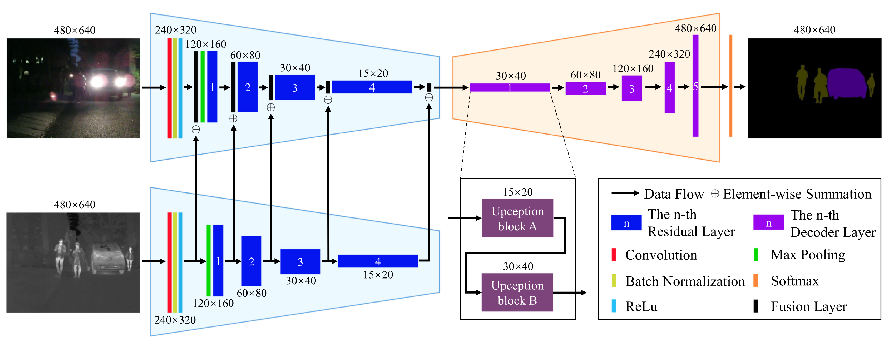
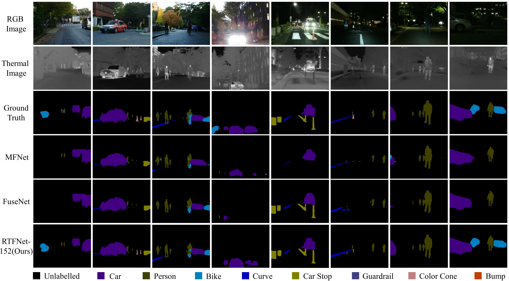

# RTFNet-pytorch

This is the official pytorch implementation of [RTFNet: RGB-Thermal Fusion Network for Semantic Segmentation of Urban Scenes](https://github.com/yuxiangsun/RTFNet/blob/master/doc/RAL2019_RTFNet.pdf) (IEEE RAL). The util, train, test and demo codes are heavily borrowed from [MFNet](https://github.com/haqishen/MFNet-pytorch). Note that our implementations of the evaluation metrics (Acc and IoU) are different from those in MFNet. In addition, we consider the unlabelled class when computing the metrics.

The current version supports Python 3.6, CUDA>=10.2 and PyTorch>=1.7, but it works fine with Python 2.7 and lower versions of CUDA and PyTorch. Please modify the `Dockerfile` as you want. If you do not use docker, please manually install the dependencies listed in the `Dockerfile`.


  
## Introduction

RTFNet is a data-fusion network for semantic segmentation. It consists of two encoders and one decoder. Although RTFNet is designed with RGB-Thermal data, it generalizes well for RGB-D data. Please take a look at another RAL [paper](https://doi.org/10.1109/LRA.2019.2932874).
 
## Dataset
 
The original dataset can be downloaded from the MFNet project [page](https://www.mi.t.u-tokyo.ac.jp/static/projects/mil_multispectral/), but you are encouraged to download our preprocessed dataset from [here](http://gofile.me/4jm56/CfukComo1).

## Pretrained weights

The weights used in the paper:

RTFNet 50: http://gofile.me/4jm56/9VygmBgPR
RTFNet 152: http://gofile.me/4jm56/ODE2fxJKG

## Usage

* Assume you have [docker](https://docs.docker.com/install/linux/docker-ce/ubuntu/) installed. First, you need to build a docker image. Then, download the dataset:
```
$ cd ~ 
$ git clone https://github.com/yuxiangsun/RTFNet.git
$ cd ~/RTFNet
$ docker build -t docker_image_rtfnet .
$ mkdir ~/RTFNet/dataset
$ cd ~/RTFNet/dataset
$ (download our preprocessed dataset.zip in this folder)
$ unzip -d .. dataset.zip
```

* To reproduce our results (for different RTFNet variants, please mannully change `num_resnet_layers` in `RTFNet.py` and `weight_name` in `test.py`):
```
$ cd ~/RTFNet
$ mkdir -p ~/RTFNet/weights_backup/RTFNet_50
$ cd ~/RTFNet/weights_backup/RTFNet_50
$ (download the RTFNet_50 weight in this folder)
$ mkdir -p ~/RTFNet/weights_backup/RTFNet_152
$ cd ~/RTFNet/weights_backup/RTFNet_152
$ (download the RTFNet_152 weight in this folder)
$ docker run -it --shm-size 8G -p 1234:6006 --name docker_container_rtfnet -v ~/RTFNet:/workspace docker_image_rtfnet
$ (currently, you should be in the docker)
$ cd /workspace
$ python3 run_demo.py
```
The results will be saved in the `./runs` folder.

* To train RTFNet (for different RTFNet variants, please mannully change `num_resnet_layers` in `RTFNet.py`):
```
$ docker run -it --shm-size 8G -p 1234:6006 --name docker_container_rtfnet -v ~/RTFNet:/workspace docker_image_rtfnet
$ (currently, you should be in the docker)
$ cd /workspace
$ python3 train.py
$ (fire up another terminal)
$ docker exec -it docker_container_rtfnet bash
$ cd /workspace/runs
$ tensorboard --bind_all --logdir=./runs/tensorboard_log/
$ (fire up your favorite browser with http://localhost:1234, you will see the tensorboard)
```
The results will be saved in the `./runs` folder.

Note: Please change the smoothing factor in the Tensorboard webpage to `0.999`, otherwise, you may not find the patterns from the noisy plots.  

## Citation

If you use RTFNet in an academic work, please cite:

```
@ARTICLE{sun2019rtfnet,
author={Yuxiang Sun and Weixun Zuo and Ming Liu}, 
journal={{IEEE Robotics and Automation Letters}}, 
title={{RTFNet: RGB-Thermal Fusion Network for Semantic Segmentation of Urban Scenes}}, 
year={2019}, 
volume={4}, 
number={3}, 
pages={2576-2583}, 
doi={10.1109/LRA.2019.2904733}, 
ISSN={2377-3766}, 
month={July},}
```

## Demos



## About VSCode and Docker

We suggest use VSCode and Docker for deep learning research. [Here](https://github.com/yuxiangsun/VSCode_Docker_Tutorial) is a tutorial.

## Contact

sun.yuxiang@outlook.com, https://yuxiangsun.github.io/

